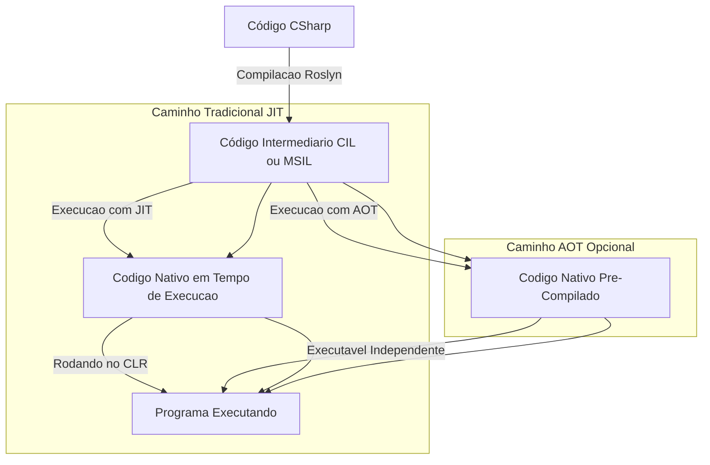

.net 
Fluxo de execução
C#, compilador Roslyn que transforma o código em CIL, commom intermediate language. um bytecode que é entendido pela CLR que ai sim traduz o CIL para a linguagem de maquina. A CLR conta com garbage collectionm segurança, paralelismo.
# Fluxo de Compilação do C# no .NET

Este diagrama mostra como o código C# é transformado em código executável no .NET, passando pelo compilador Roslyn e podendo ser executado via **JIT** ou **AOT**.




# Estrutura da CLR (.NET Runtime)

A **Common Language Runtime (CLR)** é a máquina virtual responsável por executar aplicações .NET, gerenciando memória, segurança e otimizações de desempenho.

```mermaid
graph TD;
    A[Código CSharp, FSharp, VB.NET] -->|Compilação Roslyn| B[Código Intermediário CIL ou MSIL];
    
    B -->|Carregado pelo CLR| C[Common Language Runtime];
    
    subgraph CLR
        C1[Gerenciamento de Memória] 
        C2[Compilação JIT] 
        C3[Garbage Collector] 
        C4[Segurança e Verificação] 
        C5[Execução do Código]
    end
    
    C --> C1;
    C --> C2;
    C --> C3;
    C --> C4;
    C --> C5;
    
    C5 -->|Código Nativo| D[Execução no Sistema Operacional];

