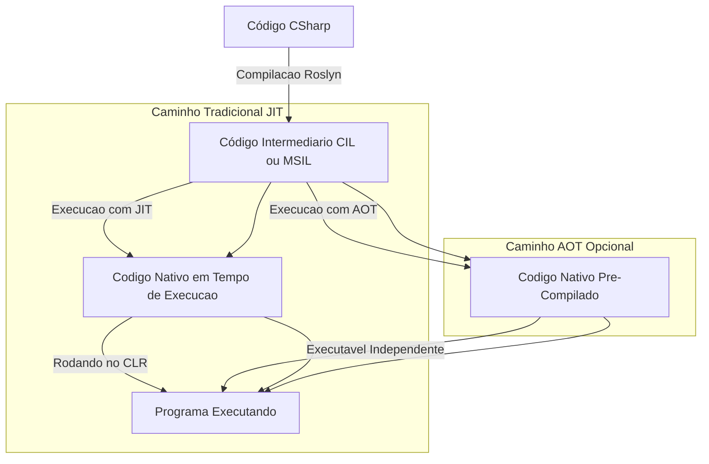
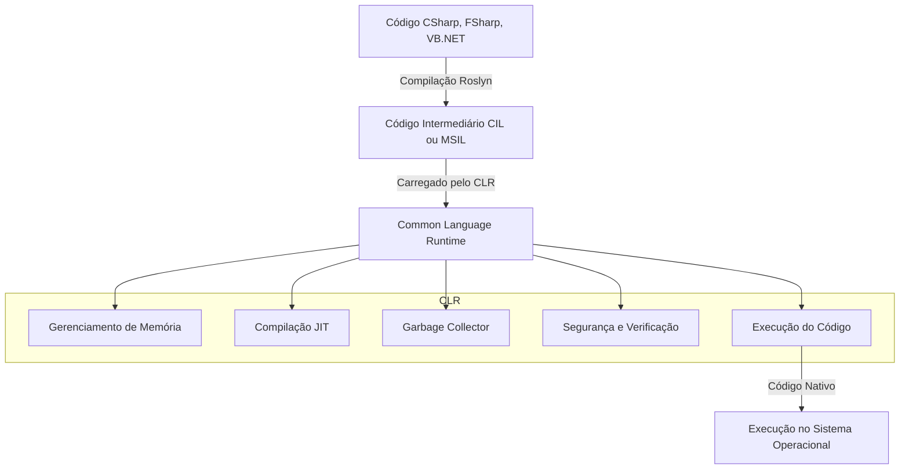
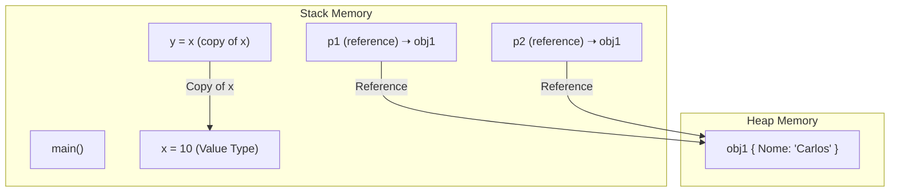

.net 
Fluxo de execução
C#, compilador Roslyn que transforma o código em CIL, commom intermediate language. um bytecode que é entendido pela CLR que ai sim traduz o CIL para a linguagem de maquina. A CLR conta com garbage collectionm segurança, paralelismo.
# Fluxo de Compilação do C# no .NET

Este diagrama mostra como o código C# é transformado em código executável no .NET, passando pelo compilador Roslyn e podendo ser executado via **JIT** ou **AOT**.




# Estrutura da CLR (.NET Runtime)

A **Common Language Runtime (CLR)** é a máquina virtual responsável por executar aplicações .NET, gerenciando memória, segurança e otimizações de desempenho.



Tipos
Todos os tipos por valor são structs: Isso inclui os tipos primitivos como int, float, double, bool, char, além de estruturas (struct) definidas pelo usuário.
Eles herdam de `System.ValueType`: Isso ocorre implicitamente, ou seja, quando você define uma struct, internamente ela já está herdando de System.ValueType, que por sua vez deriva de System.Object.

```c#
int numero = 10; // int é um Value Type, que é um struct
Console.WriteLine(numero.GetType()); // Saída: System.Int32


```

```
System.Object
   └── System.ValueType
         ├── System.Int32 (int)
         ├── System.Double (double)
         ├── System.Boolean (bool)
         ├── System.Char (char)
         ├── System.DateTime
         └── MinhasStructsPersonalizadas


```

No .NET, System.Object (ou apenas object) é a classe base de todos os tipos. Isso significa que todas as classes e tipos de referência derivam, direta ou indiretamente, dela.

Diferente dos Value Types (tipos por valor, como int, struct, bool), os Reference Types (objetos, class, string, array) são armazenados no heap e acessados por referência.


O que acontece quando usamos new?
Quando você cria um objeto com new, o .NET faz o seguinte:

- Aloca um espaço na memória heap para armazenar o objeto.
- Inicializa os valores dos membros (com valores padrão se não forem especificados).
- Retorna uma referência para o objeto criado na heap.
- Essa referência é armazenada na stack, para que o programa possa acessar o objeto.

```c#
class Pessoa
{
    public string Nome;
}

Pessoa p1 = new Pessoa(); // Aloca um novo objeto no heap
p1.Nome = "Carlos";

Pessoa p2 = new Pessoa(); // Aloca um NOVO objeto no heap
p2.Nome = "Ana";

Console.WriteLine(p1.Nome); // Carlos
Console.WriteLine(p2.Nome); // Ana


```
